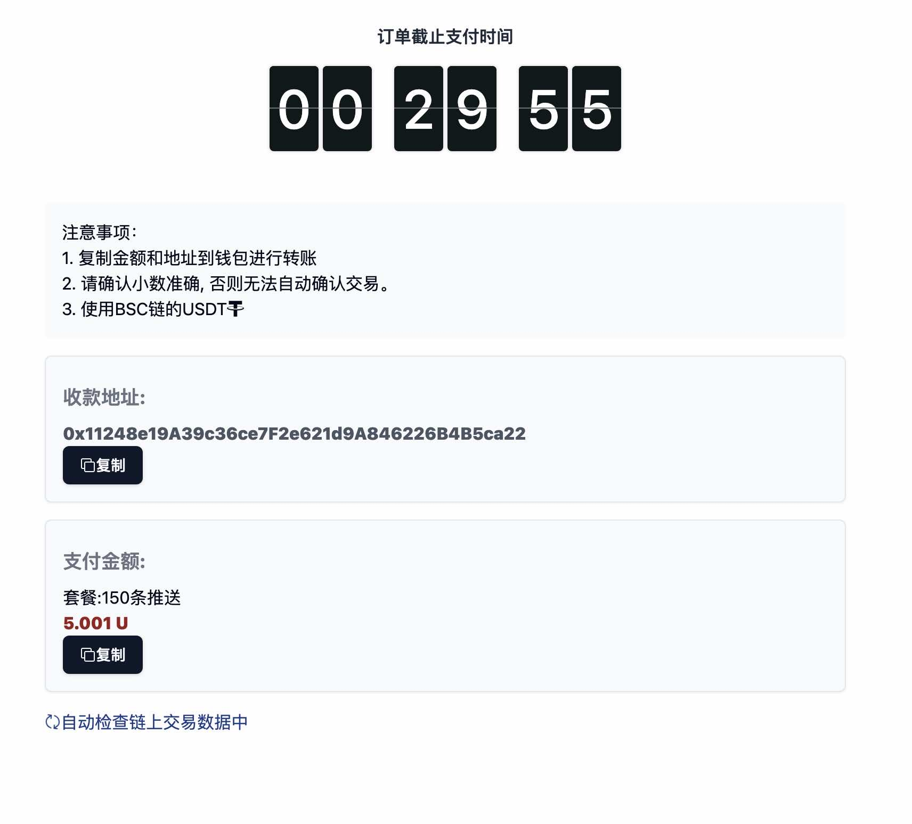
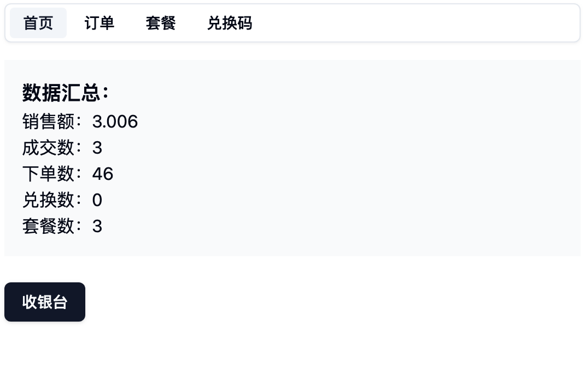

# UKA - 开源USDT发卡系统

## 系统特点：

1. 开箱默认支持BSC的USDT
2. 可定制多链多币种
3. 系统不依赖钱包私钥，安全无风险
4. 免登录, 匿名支付

[独立部署](DEPLOY.md)

## 开箱即用，无门槛实现全球收款。

## 系统原理

1. 生成时间周期内金额唯一的订单
2. 检查链上交易，金额匹配成功即支付成功
3. 在第三方系统中输入订单兑换码，核销使用

## 适用场景

1. 软件会员续期
2. 社群收费

https://uka.minapp.xin

